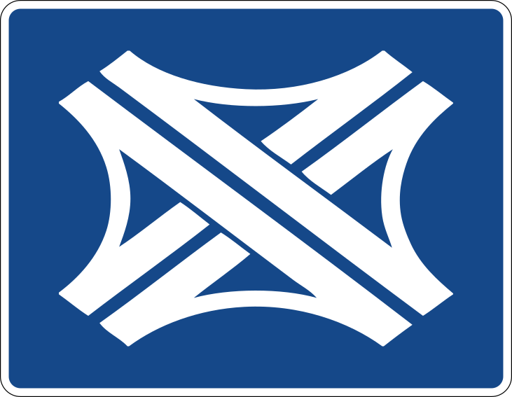

<p align="center">
  <br>
</p>
<h1 align="center">Welcome to Autobahnkreuz 👋</h1>
<p align="center">
  <a href="https://travis-ci.org/verkehrsministerium/autobahnkreuz-rs">
    
  </a>
  <a href="https://hub.docker.com/r/fin1ger/autobahnkreuz-rs">
    
  </a>
  <a href="https://hub.docker.com/r/fin1ger/autobahnkreuz-rs/tags">
    
  </a>
  <a href="https://hub.docker.com/r/fin1ger/autobahnkreuz-rs/tags">
    
  </a>
  <a href="https://github.com/verkehrsministerium/autobahnkreuz-rs/blob/master/LICENSE">
    
  </a>
  <a href="http://spacemacs.org">
    
  </a>
  <a href="http://makeapullrequest.com">
    
  </a>
  <br>
  <i>Rust implementation of a distributed, cloud-native WAMP (Web Application Messaging Protocol) router</i>
</p>

---

> Note: This project is work-in-progress and currently only pub/sub is working. **Please do not use it in production!** The router is currently quite buggy and has a lot of glitches!

## What is this?

**Autobahnkreuz** is a [Web Application Messaging Protcol v2](http://wamp-proto.org/) router that can scale-out by hosting multiple instances that are linked through TCP streams. This router is built with easy kubernetes deployment in mind. The router aims to only implement the core WAMP profile and is planned to be later expanded with plugins to implement advanced features.

The project was initially forked from [wampire v0.1.0](https://github.com/ohyo-io/wampire).

## How to use

You can run the pub/sub scenario hosting 3 instances of the router (outside of kubernetes) on your local machine by running:

```
$ ./scripts/scenarios.sh pubsub
```

> More content coming when [`simple-raft-node`](https://github.com/fin-ger/simple-raft-node) API stabilizes.

## Scientific Research

> 📄 The [`Autobahnkreuz Paper`](https://github.com/fin-ger/building-a-distributed-wamp-router/releases)

## Authors

**Fin Christensen**

> [:octocat: `@fin-ger`](https://github.com/fin-ger)  
> [:elephant: `@fin_ger@mastodon.social`](https://mastodon.social/web/accounts/787945)  
> [:bird: `@fin_ger_github`](https://twitter.com/fin_ger_github)  

## Show your support

Give a :star: if this project helped you!
